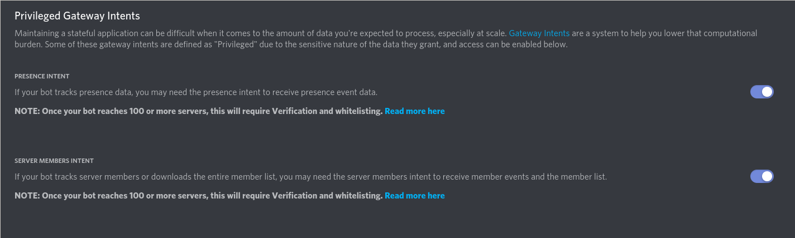

# Brock

[](https://github.com/dyc3/discord-pokemon-battles/actions/workflows/python-unit-test.yml)
[](https://github.com/dyc3/discord-pokemon-battles/actions/workflows/python-integration-test.yml)

A Discord bot that allows you to have Pokemon battles on Discord with your friends.

It uses [pokemonbattlelib](https://github.com/StevensSEC/pokemonbattlelib) served over HTTP to simulate the battles using generation 4 rules.

# Setup

Required:

-   docker
-   docker-compose
    -   https://docs.docker.com/compose/install/

Put your discord bot's token in the `token` file.

You can optionally set up a virtual environment,
```bash
conda env create -f environment.yml
conda env update -f environment.yml --prune # update an existing environment
conda activate pkmn-discord
```
and then install the development dependencies.
```bash
pip install -r requirements-dev.txt
pre-commit install
```

# Developing

```
docker-compose up
```

To force a rebuild:

```
docker-compose up --build
```

The battle API is served over port 4000, and the flask server is served over port 5000.

### Linting
You can run these scripts to check your code. (Requires the packages in requirements-dev.txt to be installed.)
```
./scripts/lint-style.sh
./scripts/lint-check-types.sh
```

# Commands

Commands are subject to change since we are in the development stage at the moment. This will be an evolving list of commands!

Prefix: `p!`

- `help`
- `ping` will return `pong`
- `challenge OPPONENT`

# Testing

## Unit Tests

```
docker-compose run bot ./scripts/test.sh
```

## Integration Tests
### Setup
1. Create another bot. This will be the "tester".
2. Make sure these settings are enabled under the `Bot` section.



3. Run `docker-compose run bot ./scripts/integration-test.sh` to create the config file at `tests/config`
4. Fill out the fields in the newly generated `tests/config`

### Running the Integration Tests
1. Make sure Brock is running
```
docker-compose up -d
```
2. Run the tests
```
docker-compose run bot ./scripts/integration-test.sh
```
If `tests/config` is not present, it will be created for you when you run the script. It requires another bot (the tester) to send messages and interact with Brock (the testee).

3. You can now stop Brock
```
docker-compose down
```
